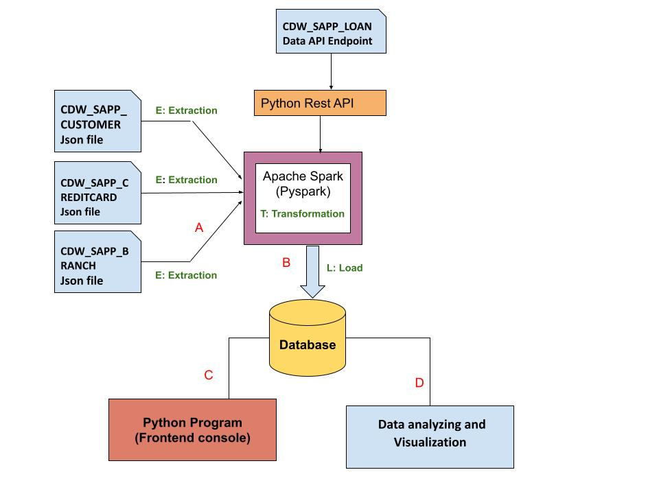

# CAP 350 - Data Engineering Capstone Project

## Table of Contents
* **Scope of Works**
* **Project Structure**
    - `credit_card_etl.py`
    - `console_based_program.py`
    - `data_analysis_and_visualization.py`
    - `loan_application_etl.py`
    - `data_analysis_and_visualization_LOAN.py`
    - `requirements.txt`
    - `README.md`
* **Data Sources & Description**
* **Workflow Diagram**
* **Challenges and Comments**
* **Conclusion**

## Scope of Works
This repository contains the capstone project for the CAP 350 - Data Engineering course, focusing on ETL processes for a Loan Application dataset and a Credit Card dataset using various technologies such as Python (Pandas, advanced modules, Matplotlib), SQL, and Apache Spark (Spark Core, Spark SQL), along with Python Visualization and Analytics libraries.

## Project Structure
* **`credit_card_etl.py`:** Python script for ETL (Extraction, Transformation, Loading) process for Credit Card System. The ETL process involves extracting data from specified JSON files, transforming the data based on mapping document requirements, and loading it into a MySQL database.

* **`console_based_program.py`:** Console-based Python program for displaying transaction and customer details. This module fulfills various functional requirements related to transaction and customer details display.

    The Transaction Details Module fulfills the following functional requirements:
    - Display transactions made by customers residing in a specified zip code for a given month and year. The display should be ordered by day in descending order.
    - Display the number and total values of transactions for a specific transaction type.
    - Display the overall number and total values of transactions for branches located in a particular state.

    The Customer Details Module meets the following functional requirements:
    - Check the existing account details of a customer.
    - Modify the existing account details of a customer.
    - Generate a monthly bill for a credit card number for a specified month and year.
    - Display the transactions made by a customer within a defined date range, ordering by year, month, and day in descending order.

* **`data_analysis_and_visualization.py`:** Python script for data analysis and visualization for the credit card system. It includes three visualizations:
    - Analyze Transaction Types with Highest Transaction Count
    - Identify States with a High Customer Count
    - Sum Transactions for the Top 10 Customers

* **`loan_application_etl.py`:** Python script for ETL process for Loan Application dataset. This part includes creating a Python program to retrieve data from a specified API endpoint, checking the status code of the API, and utilizing PySpark to load this data into an RDBMS table named `CDW_SAPP_loan_application` within the `creditcard_capstone` database.

* **`data_analysis_and_visualization_LOAN.py`:** Python script for data analysis and visualization for the LOAN Application. It includes four visualizations:
    - Percentage of Applications Approved for Self-Employed Applicants
    - Top Three Months with Highest Transaction Volume
    - Branch with the Highest Healthcare Transaction Value

* **`capstone_weichenl.py`:** This Python script serves as the project's central hub, encompassing the complete codebase. It integrates ETL processes, data analysis, and visualization functionalities, ensuring a unified and efficient workflow across the entire project.
* **`requirements.txt:`** List of required Python libraries for the project.
* **`README.md:`** This documentation provides a detailed overview of the project, including its scope, structure, data sources, and a workflow diagram illustrating the project's flow.

## Data Sources & Description
* **CDW_SAPP_BRANCH.JSON:** This JSON file contains data related to branches of the Credit Card System. Fields include BRANCH_CITY, BRANCH_CODE, BRANCH_NAME, BRANCH_STATE, BRANCH_STREET, BRANCH_ZIP and LAST_UPDATED. This table name in `creditcard_capston` Database is `CDW_SAPP_BRANCH`.

* **CDW_SAPP_CREDITCARD.JSON:** This JSON file contains data related to credit card transactions within the Credit Card System. Fields include BRANCH_CODE, CREDIT_CARD_NO, CUST_SSN, TRANSACTION_ID, TRANSACTION_TYPE, TRANSACTION_VALUE and TIMEID. This table name in `creditcard_capston` Database is `CDW_SAPP_CREDIT_CARD`.

* **CDW_SAPP_CUSTOMER.JSON:** This JSON file contains data related to customers of the Credit Card System. Fields include CREDIT_CARD_NO, CUST_CITY, CUST_COUNTRY, CUST_EMAIL, CUST_PHONE, CUST_STATE, CUST_ZIP, FIRST_NAME, LAST_NAME, LAST_UPDATED, MIDDLE_NAME, SSN and FULL_STREET_ADDRESS. This table name in `creditcard_capston` Database is `CDW_SAPP_CUSTOMER`.

* **CDW_SAPP_LOAN_APPLICATION:** This data file contains data related to loan applications. Fields include Application_ID, Gender, Married, Dependents, Education, Self_Employed, Credit_History, Property_Area, Income and Application_Status. This table name in the `creditcard_capstone` Database is `CDW_SAPP_LOAN_APPLICATION`.

## Workflow Diagram
For a visual representation of the project workflow and application requirements, refer to the workflow diagram.

## Challenges and Comments
The project involved challenges related to data extraction, transformation, and loading, especially handling diverse data formats and ensuring data accuracy. Additionally, integrating and utilizing various libraries for efficient analysis and visualization required careful consideration and experimentation.

## Conclusion
This project showcases the application of fundamental data engineering concepts and advanced analytics to gain insights from complex datasets. The combination of ETL processes, data analysis, and visualization provides a comprehensive view of the credit card and loan application domains.